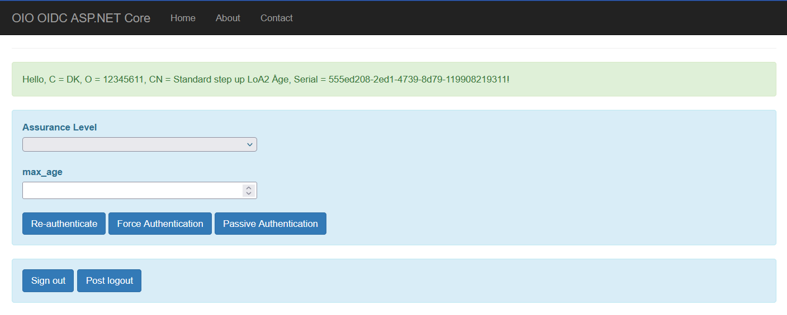

# Introduction
This project contains sample code for OAuth2 and OpenID Connect using ASP.NET Core. The application is built for demonstration and testing purposes, particularly within KOMBIT projects.

To run this sample, you will need to install [ASP.NET Core Runtime 8](https://dotnet.microsoft.com/en-us/download/dotnet/thank-you/runtime-aspnetcore-8.0.15-windows-hosting-bundle-installer).

By default, all the necessary configurations for running this application are already set up for one-click execution in Visual Studio. These configurations are placed in the "appsettings.json" file. This application supports the following features:

- Uses the Authorization Code Flow with PKCE for user authentication.

- Supports sending an authorization request with a desired assurance level and a specified max_age.

- Supports sending an authorization request to re-authenticate the user, perform passive authentication, or force authentication.

- Session management.

- Supports sending a logout request using POST or GET method.

- Supports sending an authorization request using POST or GET method.

- Supports sending a token request using a specified client authentication method like "client_secret_post", "client_secret_basic", or "private_key_jwt".

- Supports back-channel logout. The URL is at /back-channel-logout

- Supports front-channel logout. The URL is at /front-channel-logout

- Supports ID token encryption.

# Configurations

## Enable OpenID Connect session management

### Client configuration
- Edit "appsettings.json" and change the setting EnableSessionManagement to "True"

### Provisioning data
- When the EnableSessionManagement is set to "True", the /Account/ReauthenticationCallback endpoint should be added to the OIDCMetadata's redirect_uris.

## Enable post logout request
Even though an RP-initiated logout request must be made via GET, the implementation has been extended to also accept POST logout requests to support larger logout payloads. 

### Client configuration
- Edit "appsettings.json" and change the setting EnablePostLogout to "True". This option will enable the "PostLogout" button as shown in the following image:

### Provisioning data

For both GET and POST logout requests, the /Account/SignedOutCallback endpoint should be set to OIDCMetadata's post_logout_redirect_uri.

## Support both GET and POST for Authorize request

- Edit "appsettings.json" and change the setting AuthorizationEndpointMethod to "GET" or "POST"

## Support configurable Token Authentication method

- Edit "appsettings.json" and change the setting TokenAuthnMethod to "client_secret_post", "client_secret_basic", or "private_key_jwt". 

## Private Key JWT client authentication
- When using "private_key_jwt", you must provide the jwks or jwks_uri for the Identify OAuth/OIDC connection.
- You also need to provide the certificate to sign the client_assertion by configuring these two settings in "appsettings.json":
  - JwtAssertionSigningCertPath
  - JwtAssertionSigningCertPassword

## ID token encryption

To enable ID token encryption, you need to configure the following settings in "appsettings.json":
- IdTokenDecryptionCertPath
- IdTokenDecryptionCertPassword

This certificate is used to decrypt the encrypted ID token received from the Identity provider.

Note that Identify OAuth server encrypts the ID token by using the public key (use="enc") from the jwks or jwks_uri configured in the Identify OAuth/OIDC connection.
So the jwks or jwks_uri must contain the public certificate in a key (use="enc") which corresponds to the above configured ID token decryption certificate.

## Back-channel & Front-channel logout

When enabling back-channel or front-channel logout on the Identify's OIDC connection, you must disable the EnableSessionManagement by setting it to "false".
